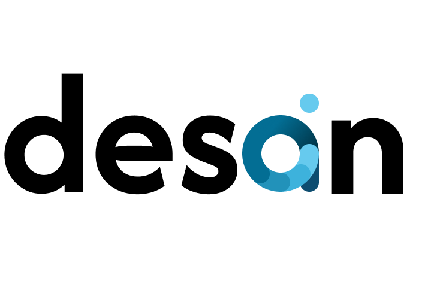

  

# DesAIn : Platform Inovatif Berbasis AI untuk Mewujudkan Transparansi Penggunaan dan Pengelolaan Dana Desa  

Selamat datang di proyek inovatif kami untuk **GovAI Hackathon 2024**! Kami adalah tim yang bersemangat dalam mengembangkan solusi teknologi untuk meningkatkan transparansi dan keamanan dalam pengelolaan dana desa. Kami percaya bahwa teknologi AI dapat membantu memastikan dana desa dikelola dengan baik dan tepat sasaran.

![Project Showcase]

## ⚡ Project Overview

Proyek kami menggunakan **Generative AI** dan **Cloud Computing** untuk menghadirkan solusi yang efisien dalam manajemen dana desa. Aplikasi ini akan otomatis memantau alokasi anggaran desa, mendeteksi pola-pola anomali, dan memberikan notifikasi dini jika terdeteksi potensi penipuan atau ketidaksesuaian anggaran dengan sistem Scouring.

Melalui teknologi AI yang andal, sistem kami mampu menghasilkan laporan keuangan real-time serta menganalisis data anggaran untuk mendukung pengambilan keputusan yang lebih tepat, efisien, dan transparan.

## 🌍 Mengapa Proyek Ini Penting

Pengelolaan dana desa yang efektif adalah kunci dalam meningkatkan kesejahteraan masyarakat dan pembangunan lokal. Transparansi dan deteksi dini terhadap ketidaksesuaian anggaran sangat penting untuk memastikan bahwa dana tersebut tepat sasaran. Dengan solusi kami, pemerintah desa dapat:

- **Meningkatkan Transparansi:** Laporan yang mudah diakses masyarakat untuk mengetahui bagaimana anggaran digunakan.
- **Mendeteksi Anomali Lebih Awal:** Mengidentifikasi penipuan atau ketidaksesuaian anggaran sehingga tindakan preventif dapat dilakukan.
- **Mendukung Pengambilan Keputusan Lebih Tepat:** Memberikan insight yang relevan berdasarkan data aktual, memudahkan pejabat desa dalam pengelolaan anggaran.

## 👥 Meet Our Team

Kami terdiri dari tim pengembang dan insinyur yang berdedikasi dalam membantu pemerintah desa mengelola dana dengan teknologi canggih. Berikut adalah anggota tim kami:

| Learning Path                         | NIM    | GitHub Link                | LinkedIn Link                          |
|------------------------------|---------------|-----------------------|-----------------------------------|
| Informatika      | H1D020044   | [Susi Setianingsih](https://github.com) | [Susi Setianingsih](https://linkedin.com)      |
| Informatika    | H1D020075   | [Muhammad Althaaf Abqary](https://github.com/taftaabqary) | [Muhammad Althaaf Abqary](https://www.linkedin.com/in/malthaafabqary/)      |
| Informatika        | H1A020015   | [Kelana Chandra Helyandika](https://github.com/momokii) | [Kelana Chandra Helyandika](https://www.linkedin.com)      |
| Keperawatan Internasional | A1D020062   | [Ruth Christine](https://github.com) | [Ruth Christine](https://www.linkedin.com)      |

## 🚀 Project Features

Kami menghadirkan berbagai fitur yang mendukung transparansi, efisiensi, dan akuntabilitas dalam pengelolaan dana desa. Berikut adalah fitur-fitur utama:

- **Fitur Scouring:** Evaluasi kesesuaian antara Kerangka Acuan Kerja (KAK) atau Rencana Anggaran Biaya (RAB) dengan laporan keuangan. Fitur ini mencakup analisis terhadap realisasi anggaran, penggunaan dana, dan waktu pelaksanaan kegiatan. Skor kesesuaian antardokumen ini membantu mengidentifikasi potensi ketidaksesuaian atau penyimpangan yang membutuhkan perhatian lebih lanjut.

- **Fitur Recommendation:** Berdasarkan hasil dari Fitur Scouring, fitur ini memberikan rekomendasi yang didasarkan pada skor kesesuaian. Rekomendasi ini bertujuan untuk membantu pengambil keputusan menindaklanjuti ketidaksesuaian yang ditemukan dan mengoptimalkan efisiensi dalam alokasi anggaran.

- **Fitur Forecasting Kebutuhan Anggaran:** Menggunakan analisis prediktif untuk melakukan proyeksi kebutuhan anggaran desa beberapa tahun ke depan. Dengan fitur ini, desa dapat merencanakan anggaran jangka panjang secara akurat, mengantisipasi perubahan kebutuhan, dan meminimalkan risiko kekurangan dana.

- **Fitur ChatAI:** Memungkinkan pengguna melakukan analisis cepat terhadap laporan keuangan desa. Fitur ini memberikan pemahaman langsung terkait kondisi keuangan serta jawaban berbasis data untuk pertanyaan spesifik yang diajukan oleh pengguna.

- **Fitur Pembuatan KAK/RAB Otomatis:** Mempermudah penyusunan KAK atau RAB secara otomatis, tanpa memerlukan pengeditan manual. Fitur ini membantu dalam perencanaan anggaran desa yang lebih cepat dan tepat.

- **Fitur Pembuatan Laporan Keuangan Otomatis:** Memungkinkan desa membuat laporan keuangan yang terstruktur dan otomatis, mengurangi beban administrasi manual, sehingga desa dapat lebih fokus pada analisis hasil.

- **Dashboard Pemantauan Anggaran:** Menampilkan indikator kunci dan informasi terkait penggunaan dana desa, seperti ringkasan keuangan, alokasi dana berdasarkan kategori, arus kas (cash flow), anggaran dan realisasi, pengeluaran terbesar dan terkecil, serta sumber pendapatan. Visualisasi interaktif ini membantu pengguna memahami data secara lebih efektif.

- **Fitur Laporan/Pengaduan:** Mendukung partisipasi masyarakat desa dalam melaporkan indikasi ketidaksesuaian atau potensi kecurangan dalam realisasi anggaran desa. Fitur ini mendorong transparansi dan meningkatkan keterlibatan masyarakat dalam pengawasan anggaran desa.

Dengan berbagai fitur ini, solusi dari kami harapannya dapat membantu pemerintah desa dalam menjaga transparansi, efisiensi, dan akuntabilitas pengelolaan dana desa, serta meningkatkan kepercayaan masyarakat terhadap pemerintah lokal.

## 🌟 Keunggulan Solusi Kami

- **Peningkatan Efisiensi:** Mengurangi waktu dan tenaga untuk pengawasan anggaran secara manual.
- **Ketepatan yang Lebih Tinggi:** Mendeteksi pola dan potensi penipuan dengan akurasi AI.
- **Mendorong Akuntabilitas:** Menyediakan laporan yang transparan untuk masyarakat dan pemangku kepentingan.

## 🔧 Branches Pengembangan

Kami membagi proyek ini menjadi beberapa branch untuk mendukung alur pengembangan yang terstruktur:

- **AI & Machine Learning:** Pengembangan model AI untuk deteksi anomali dan prediksi anggaran.
- **Cloud Infrastructure:** Pengelolaan infrastruktur cloud untuk menyimpan dan mengakses laporan.
- **Frontend Mobile Development:** Membangun antarmuka yang ramah pengguna untuk akses masyarakat.
  
## 🤝 Bergabunglah dengan Kami!

Kami membuka kesempatan untuk kolaborasi! Jika Anda tertarik pada teknologi AI dan ingin ikut serta dalam meningkatkan transparansi dana desa, kami akan dengan senang hati berkolaborasi dengan Anda!

## 📞 Hubungi Kami

Ada pertanyaan, saran, atau sekadar ingin mengenal kami lebih dekat? Hubungi kami!

- Email: taftaraharjo@gmail.com

Ayo, bersama-sama kita wujudkan transparansi dalam pengelolaan dana desa dengan teknologi AI yang inovatif! 🌍
